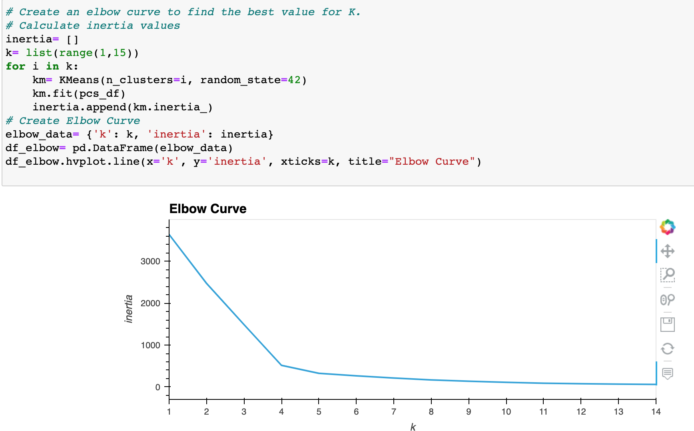
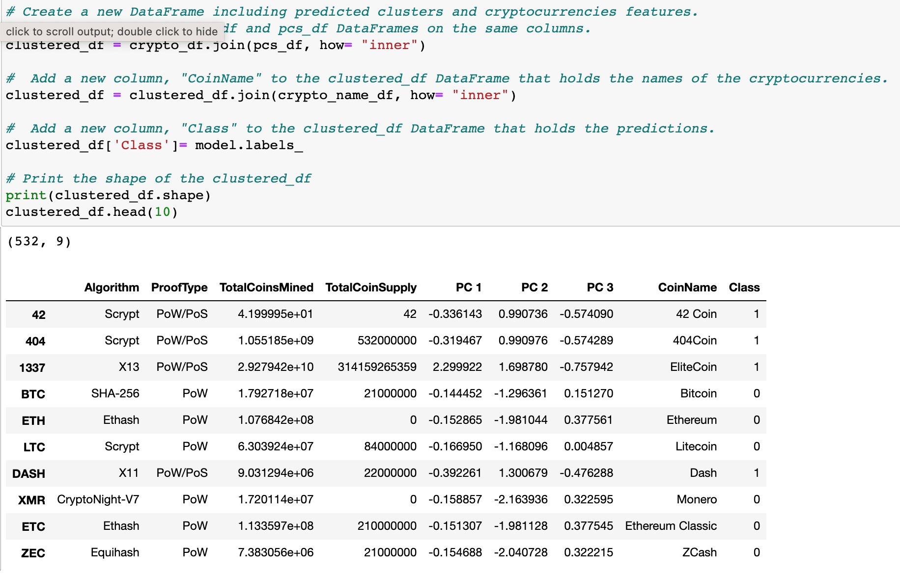
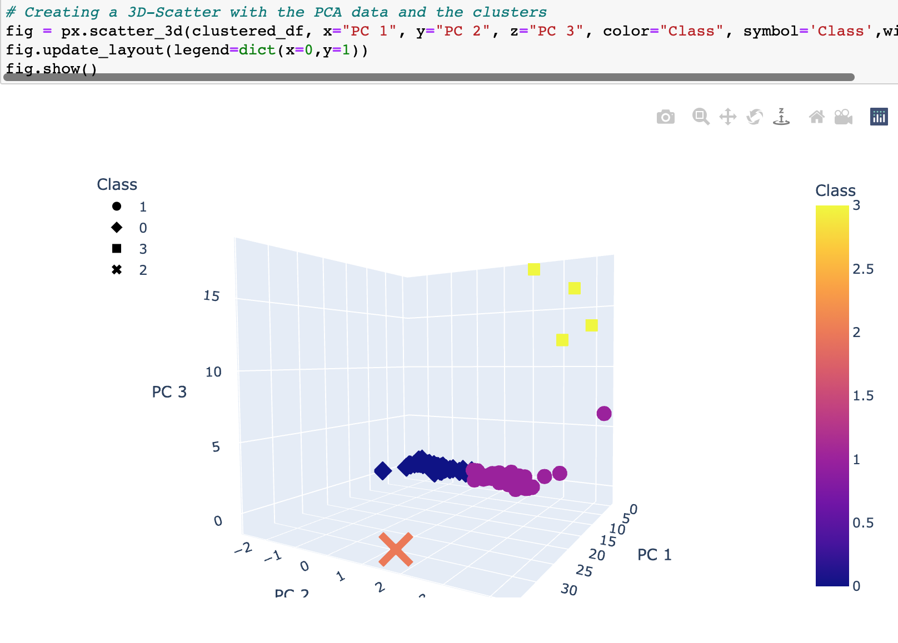
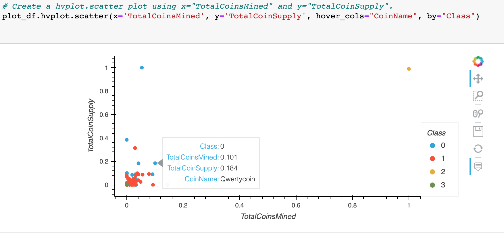

# cryptocurrencies
## Project Overview
In order to provide insight into Cryptocurrencies as an investment, this project attempts to take a large flat cvs file with data on a number of cryptocurrencies and group them in a way that provides meaningful information for our clients, potential Crypto investors. Since not much is known about the data or our target info, unsupervised machine learning algorithms are used to model and group the data. 

## Resources
Data Source: crypto_data.csv from CryptoCompare  
Software Used: Python 3.8.8, Pandas, Jupyter Notebook, Virtual Studio Code 1.57.0

## Preprocessing the Data
* To prepare the data for our eventual modeling, it first needed to be cleaned, transformed, and scaled. Below you can see how the data was cleaned, by dropping rows with Null Values, dropping rows any coins that had not been mined, and dropping coins that were not being traded.
    *   
* Then using the get_dummies() method in Pandas, the string variables in the "Algorithm" and "ProofType" columns were converted to numerical data
* This numerical data was scaled using the StandardScaler function to normalize the data.  
* Finally, we used PCA to reduce the dimensions of our data from 5 down to 3 principal components.

## Analysis

* To find the best value for K when using our K-means algorithm, we created an elbow curve to identify that K-value
    * 
* Using k=4, we then created a new dataframe by joining our previous data, along with the cryptocurrency names, and the new predicted classes with our K-means model
    * 

* Below are two plots that we made using our model predicted classes. 
    * In the 3-d model we plotted using our PCA values as our X, Y, and Z values, and separated each class with a different shape and color.
    * 
    * In our next plot we looked at the total number of coins mined vs number of coins available, separating coins by class.
    * 

## Summary

